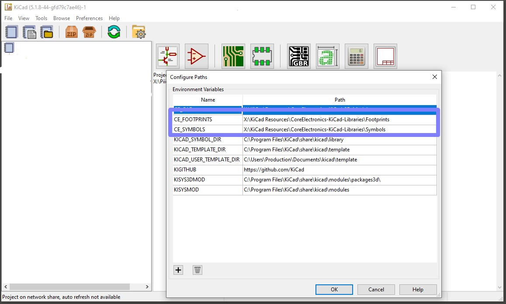

# Core Electronics KiCad Libraries
---
This repository collects the custom symbols, footprints and artwork assets used in Core Electronics original designs.

 - [/Symbols](/Symbols) - Eeschema symbols
 - [/Footprints](/Footprints) - Pcbnew footprints
 - [/Images](/Images) - Graphics referenced in this document

# How to install these libraries
---
- **Clone**, or download + unzip this repo to a known location.
- **Create environment variables** - Tell KiCad where the libraries are:
  - In KiCad, open the *Configure Paths* dialogue (Preferences > Configure Paths):
  - Create a variable named `CE_FOOTPRINTS` and set its path to the location of the `.../CoreElectronics-KiCad-Libraries/Footprints` directory
  - Create a variable named `CE_SYMBOLS` and set its path to the location of the `.../CoreElectronics-KiCad-Libraries/Symbols` directory
  
- **Add Symbols and Footprints to KiCad's library tables**
  - Open `Preferences > Manage Symbol Libraries` and select the `Global Libraries` tab.
  - Add Existing Library to Table: Click the folder icon and navigate to `.../CoreElectronics-KiCad-Libraries/Symbols`. Select all the libraries you want to add to the table.
  - Repeat the process for footprints: `Preferences > Manage Footprint Libraries`

  
  

Notice that the library tables use the environment variables that we defined before. Now, if you need to move the library repo you can redefine the Environment Variables instead of modifying each library entry in the library tables.

# License
---
This project is open source - please review the LICENSE.md file for further licensing information.

If you have any technical questions, or concerns about licensing, please contact technical support on the [Core Electronics forums](https://forum.core-electronics.com.au/).
